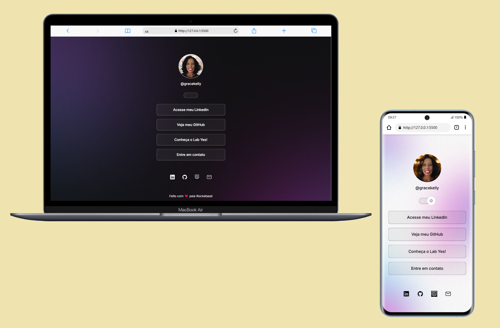
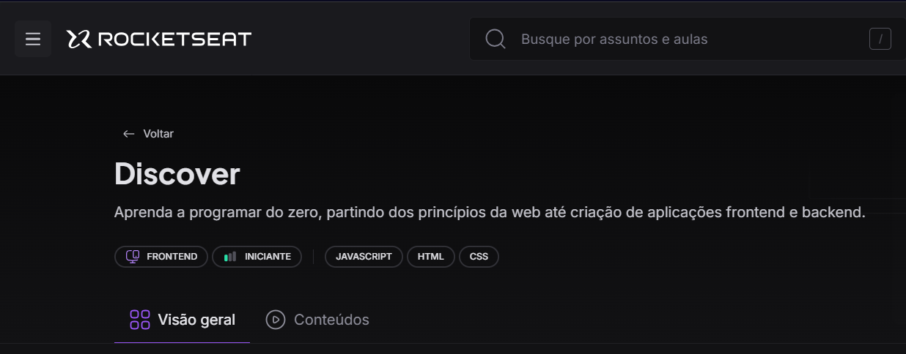
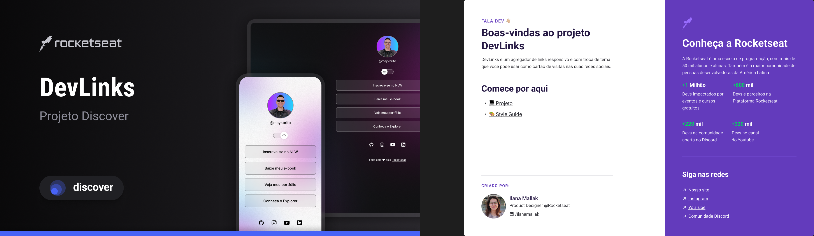
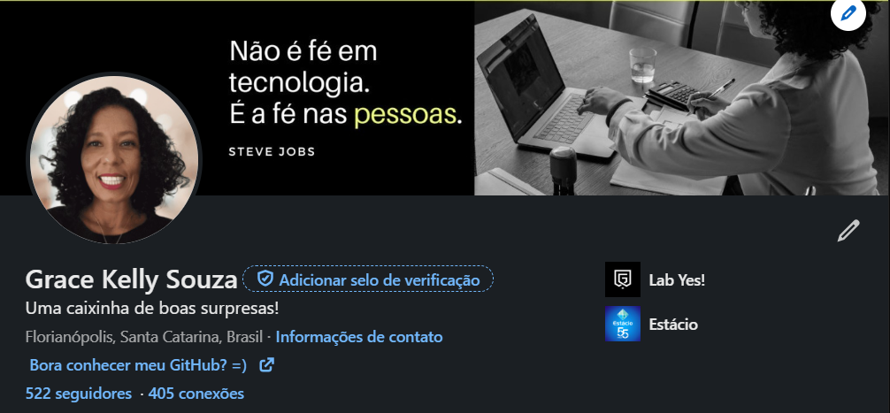

# Cartão Digital

## Vamos nos conectar? 🚀

👩🏽‍💻 Acesse o link do projeto clicando na imagem:

    
 

 (Não se preocupe, usei target=_blank para você abrir outra página, e manter a atual) 🤓

## 🔰 Tecnologias

HTML | CSS | JavaScript | Git e Github | Figma

## 💡 Meu Projeto
Esse projeto é a conclusão de estudos realizados através do Discover _(clique na imagem para conhecer o programa)_ 

    
 

 Em poucos dias construí um cartão profissional com pegada _on line_ visando apresentar meus conhecimentos técnicos e ampliar conexões semelhantes. Utilizei (um pouquinho) de JavaScript, surfei nas maravilhas do mundo CSS, tendo como estrutura o nosso querido HTML, o que seríamos de nós sem ele?

## Design no Figma
 

    
 

## 🤸🏽‍♂️ Contato
Acredito que semelhantes atraem semelhantes, e se você também, então temos algo em comum, além de gostar de bolo de laranja e tecnologia.

😁
Acesse meu perfil no LinkedIn e #boraláserfeliz!

    
 

 ## ✨ Agradecimentos
Impossível deixar de citar o **[Mayk Brito](https://www.linkedin.com/in/maykbrito/)** que tem a melhor didática da Galáxia!, e com sua magia tornou para mim, possível tudo aquilo que pensei ser impossível. _"Sou sua fã desde a primeira vez que assisti seu sorriso revelar a melhor versão de mim."_

A **[Rocketseat](https://www.rocketseat.com.br/)** _(principalmente no período da Turma 1 do Explorer, a qual tenho a honra de ter feito parte)_ por criar a melhor comunidade no Discord da qual tive a honra de conhecer pessoas brilhantes das quais até hoje tenho a honra de confraternizar.

Ao **[Jonisson Gomes](https://www.linkedin.com/in/jonisson-tazz/)** quando aceitou meu convite para codarmos juntos.

E não menos importante: ao meu maior protetor e incentivador, disfarçado de marido amado, meu sempre Mozão, **[Adriano R S Souza](https://www.linkedin.com/in/adriano-rs-souza/)**, sem seu apoio nada disso seria possível. Te amooo!! ❤️